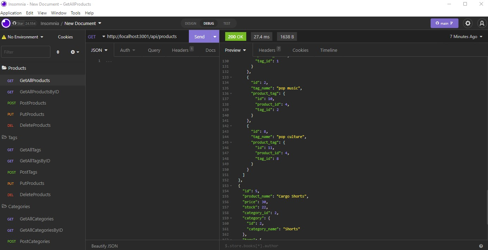
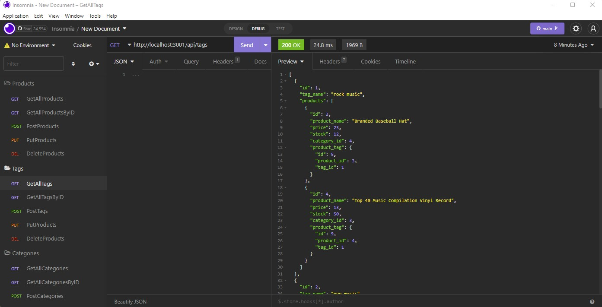

# E-commerce Back End 

## Description

A short description explaining the what, why, and how of project "Employee-Tracker":

An application called "Employee-Tracker" that is a command-line application which can manage a company's employee database, using Node.js, Inquirer, and MySQL.

A walkthrough video that demonstrates its functionality is included with a link to the video of your project. 

## User Story

AS A manager at an internet retail company

I WANT a back end for my e-commerce website that uses the latest technologies

SO THAT my company can compete with other e-commerce companies

## Acceptance Criteria

GIVEN a functional Express.js API

WHEN I add my database name, MySQL username, and MySQL password to an environment variable file

THEN I am able to connect to a database using Sequelize

WHEN I enter schema and seed commands

THEN a development database is created and is seeded with test data

WHEN I enter the command to invoke the application

THEN my server is started and the Sequelize models are synced to the MySQL database

WHEN I open API GET routes in Insomnia Core for categories, products, or tags

THEN the data for each of these routes is displayed in a formatted JSON

WHEN I test API POST, PUT, and DELETE routes in Insomnia Core

THEN I am able to successfully create, update, and delete data in my database


## Installation

Pulling the GitHub repository from the follwing URL: https://github.com/RamRod79/E-commerce.git and typing the follwoing command ,'npm install', in the terminal will ensure the dependencies are installed and the program can run properly.

- Download and run mysql server.

- Download the repository to your own local machine and run it from your command line.

- Run ```npm i``` or ```npm install``` in order to download all the dependencies.

- MySQL instructions to create your tables:

        - Enter ```mysql -u root -p``` in the terminal window.
        - Enter your mysql password. 
        - Create database by entering ```CREATE DATABASE employeeTracker_db;``` and enter.
        - Then enter ```SHOW databases;```.
        - To use the employees database; enter ```USE employeeTracker_db;```.
        - In order to use your .sql files enter ```source db/schema.sql;``` and enter, then type ```source db/seeds.sql;``` and enter.
        - Exit MySQL by entering ```quit;```.
  
  Run ```node index.js``` or ```npm start``` in your terminal to satrt.

## Usage




## Credits

List of collaborators:

- UCLA Extension, Coding Bootcamp Instructor and TAs

## License

The following licenses have been used in the development of this project:

[](https://opensource.org/licenses/MIT)

## Badges


## Repo Features

Using this repo can be initiated by running 'npm run Start' in the command terminal after opening the integrated terminal to initiate the program. Using this repo requires express and nodemon, and updated node modules to ensure application runs properly.

## How to Contribute

If other developers would like to contribute, you can contact me at armando.rod79@gmail.com.

## URL
GitHub: https://github.com/RamRod79/Ecommerce.git

video: https://drive.google.com/

## Contact Info

For any other issues or comments please contact me at:

GitHub username: RamRod79

Email: armando.rod79@gmail.com